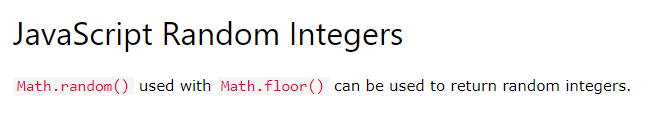

# Generate-Password

Description of the Project:

Character Types : Special Characters, Uppercase, Lowercase & Numeric Characters.

This project is guiding the users to Generate Password between 8 to 128 characters long which alert the user to choose the password.
I defined function getPasswordOptions() to prompt user's for password options/preferences.
Declaring a variable passwordlength with parseInt method to choose between 8 to 128 characters for the password.
Declared the variables - var useNumbers, var useSymbols, var useUppercase, & var useLowercase to take the confirmation from the user for choosing character type.
Using allArrays[] to concat all the character type in the Array using if statement.
Declaring passwordstring as a empty string and for loop to keep adding characters.
To get Random index - used Math.random() function and declaring let randomcharacter= allArrays [randomindex], also adding  passwordstring= passwordstring + randomcharacter to add randomcharacters in a passwordstring and finally console.log(passwordstring).
 
 

 Used function generatePassword() to generate password with user input -  declaring & returning finalPassword.

 
 Links used :
https://www.w3schools.com/js/js_random.asp
https://www.w3schools.com/jsref/jsref_concat_array.asp